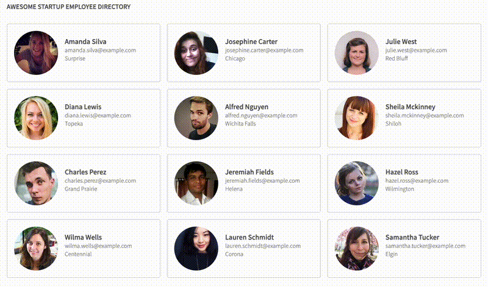

# Employee Directory
This was a very early-stage project in the Team Treehouse [Front-End Web Development Tech Degree](https://teamtreehouse.com/techdegree/front-end-web-development) program. I completed the program in 2019. [View my Certificate](https://www.credential.net/1700e85d-d29e-493d-a28e-a8c1860459c8#acc.PS7ITKNb)

The objective was to implement an employee directory layout using the [randomuser.me API](https://randomuser.me/), an open source API for generating random user data.

[View Live Project](https://heidifryzell.com/fetd-project-8/)

## How It's Made:
### Tech Used:
   

## Optimizations

- Text is hard to read,light gray text on white, possible accessibility issues

## Lessons Learned

This was my first project using an API! I learned how to retrieve data from an API and utilize promise objects.

## Related Projects
This repo was a dashboard-building exercise for a class at the beginning of my developer journey.

Here is my current portfolio:

<table border="1">
  <tr>
    <td style="text-align: center;"><a href="https://heidifryzell.com">heidifryzell.com</a></td>
  </tr>
  <tr>
    <td></td>
  </tr>
</table>
